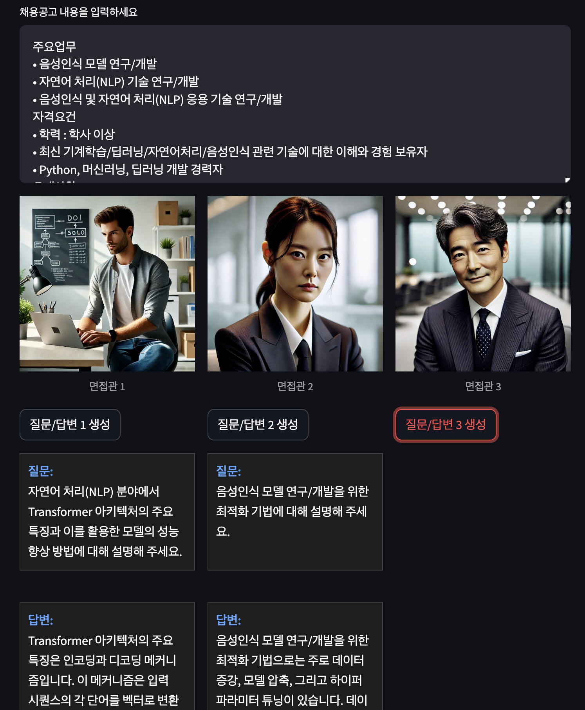

# AI 면접 질문 생성기

이 프로젝트는 채용공고 내용을 바탕으로 면접관과 면접자를 위한 질문 및 답변을 자동으로 생성하는 AI 도구입니다.

## 주요 기능

- 채용공고 내용 입력 기능
- 세부 개발 지식 관련 질문 생성
- 일반적인 면접 질문 생성
- 각 질문에 대한 모범 답변 생성
- 면접관과 면접자 양측을 위한 3개의 질문-답변 세트 제공

## 사용 방법

1. 개발자 채용공고 내용을 입력 창에 붙여넣고 '면접 질문 생성' 버튼을 클릭합니다.

    

2. 질문과 답변이 생성됩니다. 각 질문과 답변에 해당하는 버튼을 누르면 해당 질문 및 답변이 표시됩니다.

    

## 테스트

다음 URL에서 AI 면접 질문 생성기를 직접 테스트해보실 수 있습니다: url

## 라이선스

...